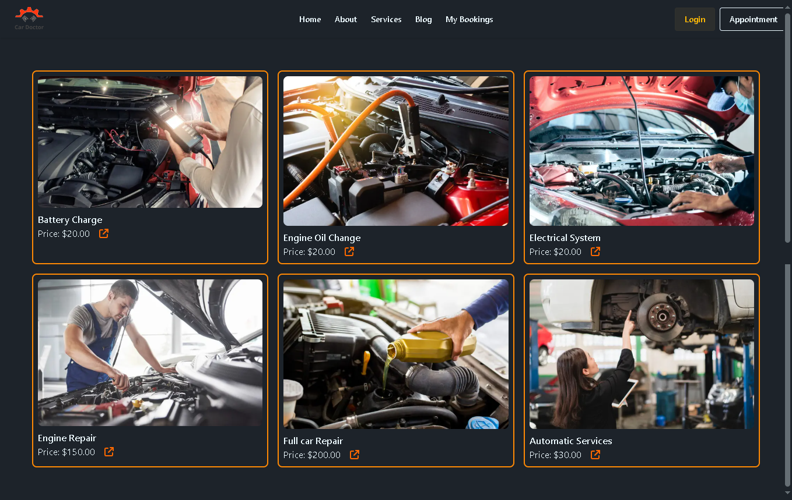

---

# 🚗 Car Doctor Next.js

A full-stack car service appointment and management web application built with **Next.js 15**, **MongoDB**, and modern React tools. This app lets users book car services such as battery charge, oil change, and electrical system diagnostics with an easy-to-use interface.

---

## 📋 Table of Contents

* [Introduction](#introduction)
* [Features](#features)
* [Tech Stack](#tech-stack)
* [Installation](#installation)
* [Usage](#usage)
* [Configuration](#configuration)
* [Available Scripts](#available-scripts)
* [Examples](#examples)
* [Troubleshooting](#troubleshooting)
* [Contributors](#contributors)
* [License](#license)

---

## 📖 Introduction

**Car Doctor Next.js** helps car owners quickly schedule and manage essential car maintenance services online. It provides a smooth user experience for booking services and managing appointments securely.

---

## ✨ Features

✅ User Authentication (NextAuth)
✅ Secure Password Hashing (bcrypt)
✅ Service Listings (e.g., Battery Charge, Engine Oil Change, Electrical System)
✅ Appointment Booking
✅ Responsive UI with Tailwind CSS and DaisyUI
✅ Toast Notifications (react-hot-toast & SweetAlert2)
✅ Modern React 19 features
✅ ESLint integration for clean code

---

## ⚙️ Tech Stack

* **Framework:** [Next.js 15](https://nextjs.org/)
* **Database:** [MongoDB](https://www.mongodb.com/)
* **Authentication:** [NextAuth.js](https://next-auth.js.org/)
* **Styling:** [Tailwind CSS](https://tailwindcss.com/), [DaisyUI](https://daisyui.com/)
* **Notifications:** [react-hot-toast](https://react-hot-toast.com/), [SweetAlert2](https://sweetalert2.github.io/)

---

## 💻 Installation

1️⃣ Clone the repository:

```bash
git clone https://github.com/your-username/f-car-doctor-nextjs.git
cd f-car-doctor-nextjs
```

2️⃣ Install dependencies:

```bash
npm install
```

3️⃣ Setup environment variables:
Create a `.env.local` file and add your MongoDB URI and NextAuth secrets:

```env
MONGODB_URI=your_mongodb_uri
NEXTAUTH_URL=http://localhost:3000
NEXTAUTH_SECRET=your_secret_key
```

---

## 🚀 Usage

Run the development server:

```bash
npm run dev
```

Build for production:

```bash
npm run build
npm start
```

---

## ⚙️ Configuration

* **MongoDB:** Required for storing user data and bookings.
* **NextAuth:** Handles authentication securely.
* **Tailwind & DaisyUI:** Used for custom styling.

---

## 📜 Available Scripts

| Script          | Description                               |
| --------------- | ----------------------------------------- |
| `npm run dev`   | Run the development server with Turbopack |
| `npm run build` | Build the production version              |
| `npm start`     | Start the production server               |
| `npm run lint`  | Lint your code with ESLint                |

---

## 📷 Examples

Below are example services available in the app:

* **Battery Charge:** \$20.00
* **Engine Oil Change:** \$20.00
* **Electrical System:** \$20.00


---

## 🐞 Troubleshooting

* **NextAuth errors:** Check your `.env.local` for correct `NEXTAUTH_URL` and `NEXTAUTH_SECRET`.
* **Database connection issues:** Ensure your MongoDB URI is valid and your cluster is accessible.
* **Styling issues:** Ensure Tailwind CSS and DaisyUI are installed and configured properly.

---

## 👨‍💻 Contributors

* **Your Name** — *Project Creator*

---

## 📄 License

This project is licensed under the MIT License.




---

